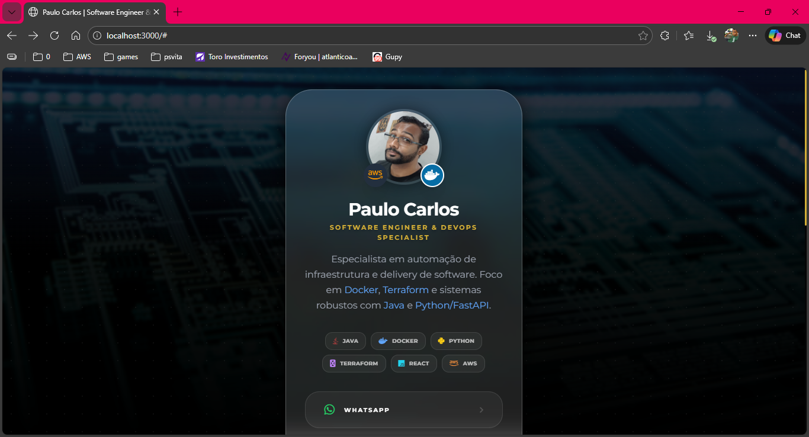
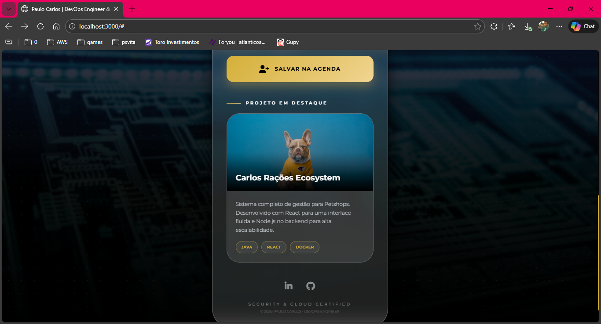

# Digital Business Card - Paulo Carlos (DevOps Engineer)

<div align="center">
  
  
</div>

Cartão de visitas digital e portfólio técnico focado em infraestrutura, automação e desenvolvimento backend.

## 🚀 Tecnologias
- React, TypeScript, Tailwind CSS

## 🚀 Como Rodar

Você pode usar os comandos do `npm` ou o `Makefile` incluído (recomendado para DevOps):

### Usando Makefile (Recomendado)
```bash
make install   # Instala dependências
make dev       # Roda o projeto
make build     # Gera o build de produção
```

### Usando NPM
```bash
npm install
npm run dev
```

3. **Acesse no navegador:**
   Abra [http://localhost:3000](http://localhost:3000)

---
*Este projeto é uma vitrine técnica para recrutadores e parceiros.*
